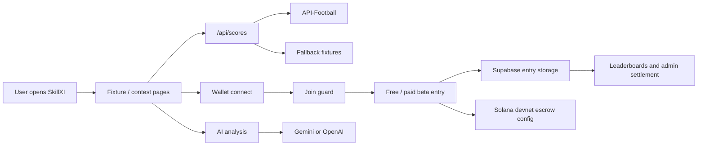

# SkillXI

<p align="center">
  <strong>Wallet-native fantasy football with live fixtures, AI lineup help, Solana devnet flows, private lineup storage, and admin settlement tools.</strong>
</p>

<p align="center">
  A production-minded fantasy sports beta that blends football data, wallet UX, lineup strategy, and compliance guardrails.
</p>

<p align="center">
  
  
  
  
</p>

---

## The Pitch

Fantasy sports should feel like a live trading floor, not a spreadsheet with a timer.

**SkillXI** is a wallet-native fantasy football beta with:

- live football fixtures
- contest lobby flows
- wallet-gated joining
- lineup building
- AI player analysis
- global leaderboards
- admin settlement screens
- Solana devnet escrow configuration
- KYC, geo, and paid-beta guardrails

It is built like a real product prototype, not a static landing page.

## What It Ships

| Feature | What it does |
| --- | --- |
| Live contests | Pulls upcoming and live fixtures from API-Football |
| Fallback fixtures | Keeps the app usable even without provider keys |
| Wallet connect flow | Requires wallet identity before contest joins |
| Match lobby | Turns fixtures into contest entry points |
| Lineup builder | Lets users compose fantasy squads |
| Roster lab | Experiment area for lineup strategy |
| AI chat | Gemini/OpenAI-backed assistant route for analysis |
| Player analysis | Dedicated player insight surface |
| Leaderboards | Contest and global ranking pages |
| Admin panel | Admin-authenticated settlement and control views |
| Join guard | Paid beta checks for KYC, region, allowlist, and entry cap |
| Supabase persistence | Optional entry/profile storage |
| Solana config | Devnet escrow and payout configuration hooks |
| PWA shell | Manifest and service worker for app-like behavior |

## Product Map

| Page | Purpose |
| --- | --- |
| `/` | Landing and app entry |
| `/onboarding.html` | User onboarding |
| `/contests.html` | Contest discovery |
| `/match-lobby.html` | Match-specific contest lobby |
| `/lineup.html` | Lineup creation |
| `/roster-lab.html` | Lineup experimentation |
| `/player-analysis.html` | Player-level analysis |
| `/ai-chat.html` | AI assistant surface |
| `/leaderboard.html` | Contest leaderboard |
| `/global-leaderboard.html` | Global ranking |
| `/profile.html` | User profile |
| `/wallet.html` | Wallet state and connection |
| `/payout.html` | Payout/settlement surface |
| `/admin.html` | Admin controls |
| `/privacy.html` | Privacy policy |

## Architecture



## Serverless API

| Endpoint | Purpose |
| --- | --- |
| `/api/health` | Reports configured integrations and safety controls |
| `/api/scores` | Live/upcoming fixture and player data proxy |
| `/api/ai` | AI assistant proxy through Gemini/OpenAI |
| `/api/join-guard` | Paid beta compliance checks |
| `/api/actions/join` | Join action endpoint |
| `/api/admin` | Admin auth/session/control endpoint |

## Health Check Example

```bash
curl https://your-skillxi-deploy.vercel.app/api/health
```

Returns integration readiness:

```json
{
  "ok": true,
  "service": "skillxi",
  "integrations": {
    "footballApi": true,
    "gemini": true,
    "supabaseUrl": true,
    "adminAuth": true,
    "kycProvider": false,
    "escrow": true
  },
  "controls": {
    "paidBetaMode": "kyc_or_blocked",
    "solanaNetwork": "devnet"
  }
}
```

## Safety And Compliance Guardrails

SkillXI is deliberately cautious around paid fantasy flows:

- paid contests are treated as beta
- devnet defaults are explicit
- region restrictions are configurable
- paid beta allowlist is supported
- max entry size is capped
- KYC provider configuration is checked
- admin auth uses server-issued session tokens
- production readiness notes are documented

Read:

- [`docs/PRODUCTION_READY.md`](./docs/PRODUCTION_READY.md)

## Environment Variables

```bash
FOOTBALL_API_KEY=
GEMINI_API_KEY=
OPENAI_API_KEY=
SUPABASE_URL=
NEXT_PUBLIC_SUPABASE_URL=
SUPABASE_ANON_KEY=
NEXT_PUBLIC_SUPABASE_ANON_KEY=
ADMIN_PASSWORD=
ADMIN_SESSION_SECRET=
PAID_BETA_ALLOWLIST=
RESTRICTED_COUNTRIES=US,IN,CN,KP,IR,SY,CU,RU
MAX_BETA_ENTRY_SOL=0.25
KYC_PROVIDER_URL=
KYC_API_KEY=
ESCROW_ADDRESS=
ESCROW_OWNER_WALLET=
SOLANA_NETWORK=devnet
```

## Local Development

This repo is structured for Vercel-style static pages plus serverless API routes.

```bash
npm install
vercel dev
```

Health check:

```bash
curl http://localhost:3000/api/health
```

## Production Readiness Checklist

Before real-money or public paid contests:

- Verify legal status for every supported region.
- Configure a real KYC provider.
- Confirm escrow custody and payout operations.
- Move sensitive admin mutations fully server-side.
- Confirm Supabase storage rules.
- Run `/api/health` and verify required integrations.
- Test free contest joins.
- Test paid beta blocks for non-allowlisted wallets.
- Test settlement and leaderboard updates.

## Roadmap Ideas

- Fully on-chain contest settlement
- More football league controls
- Real-time live match scoring
- Wallet reputation for contest trust
- Social squad sharing
- Referral loops
- Public contest marketplace
- Mobile-first install flow
- Better lineup recommendation engine

## Status

SkillXI is a devnet/beta fantasy football product prototype. It is not production-ready for unrestricted paid contests until legal, KYC, escrow, payout, and incident-response systems are formally approved.

If you are into fantasy sports, Solana UX, and consumer crypto products, star the repo and build the next matchday loop.
